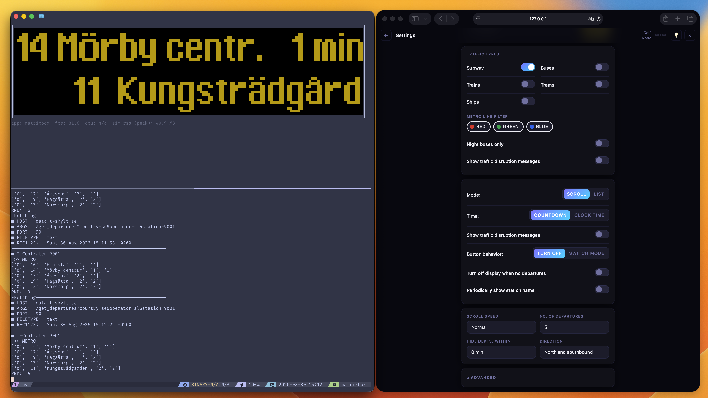

# matrixbox-simulator

[](https://github.com/MatrixBOX-dev/simulator/actions/workflows/ci.yml)


A desktop simulator for [matrixbox][matrixbox], the [CircuitPython][circuitpython]
app that drives an LED matrix on a Waveshare ESP32-S3-Zero. Runs an app's
real, unmodified code on your desktop Python interpreter and streams what
it draws to a terminal renderer, no hardware needed.



## Installation

```sh
pip install matrixbox-simulator
```

Or, as a tool with [uv][uv]:

```sh
uv tool add matrixbox-simulator
```

## Requirements

- Python 3.11+
- A local checkout of [matrixbox][matrixbox-source], pointed at explicitly
  (see below).

## Quick start

Terminal 1, point it at your [matrixbox][matrixbox-source] checkout —
either its root, to boot the whole system and pick an app from its home
menu:

```sh
matrixbox app /path/to/matrixbox
```

or one specific app directly, to autostart straight into it:

```sh
matrixbox app /path/to/matrixbox/apps/clock
```

Terminal 2, watch it:

```sh
matrixbox simulator
```

Connects to `ws://127.0.0.1:9191` by default, matching `matrixbox app`'s
own default port — use `--connect <url>` if you changed it. The renderer
waits for the simulator if it isn't up yet, and reconnects automatically
if you stop it to switch apps, so you can just leave it running.

While an app is running, its real settings page is served too, at
`http://127.0.0.1:8080/` (override with `MATRIXBOX_SIMULATOR_HTTP_PORT`).

No app running yet? `matrixbox simulator --demo` draws an animated demo
pattern instead, a quick way to check it's working.

## Panel sizes

`matrixbox app --size {XS,X,XL,2X}` picks a real product size (width and
height together). `matrixbox simulator --device {XS,X,XL,2X}` sizes the
demo pattern and the placeholder box to match; combining it with
`--width`/`--height` is an error, since they'd conflict.

| Size | Dimensions | Panels |
| ---- | ---------- | ------ |
| `XS` | 64x32      | 1      |
| `X`  | 128x32     | 2      |
| `XL` | 192x32     | 3      |
| `2X` | 128x64     | 1      |

Panel count is a display-only idea, for the renderer's tile-seam overlay
— real firmware always saves `tiles: 1` regardless of size, and so does
this sim. `--width`/`--height` work directly for any other size, with no
seam overlay.

Real hardware only reads panel geometry from `settings.txt` at boot and
reboots whenever it changes, since the wiring can't reconfigure live.
This sim does the same: changing width/height from the settings UI, or
`z` cycling through sizes from the `matrixbox app` terminal, both reboot
the process. Whatever an app already saved survives the restart either
way.

Selecting XL also rotates the panel 180°, matching real firmware — it
doesn't reset the rotation back when you switch away from XL either,
also matching real firmware.

## Controls

Typed into whichever terminal is running `matrixbox app` (needs a real
terminal, not a redirected or piped one):

- `s` / `l`: short or long front-panel button press. Long usually exits
  the app, same as holding the real button.
- `r`: reload by restarting the whole process, picking up any code
  change (app or core), then boots straight back into whatever was
  running.
- `+` / `-`: adjust refresh pacing live. See "Animation speed" below.
- `[` / `]`: adjust color gamma live. See "Colors" below.
- `z`: cycle through panel sizes live. See "Panel sizes" above.

Typed into whichever terminal is running `matrixbox simulator` instead:

- `t`: toggle a guide line at each panel seam (see "Panel sizes"). Off
  by default; current state always shows in the stats line underneath.

## Animation speed

Real hardware paces itself: `display.refresh()` takes real time to
bit-bang pixels out over GPIO. This sim's `refresh()` is close to free,
so an app that relies on that cost for its own pacing runs faster than
real hardware unless you give it back.

`--refresh-fps <n>` (live: `+`/`-`) gives `refresh()` a small, roughly
constant per-call cost. Off (0) by default — most apps don't need it.
Known-good values:

| App                       | `--refresh-fps` |
| ------------------------- | --------------- |
| `departures`              | 120             |
| `screensaver` (aquarium)  | 20              |
| `screensaver` (fireworks) | 60              |
| `screensaver` (rain)      | 24              |
| `screensaver` (space)     | 90-100          |
| `screensaver` (starcloud) | 90-100          |

`screensaver` picks which saver runs from its own settings, so the right
value depends on which one is active. Everything else, `lastfm`
included, looks right left alone.

## Colors

Some apps look dimmer here than on real hardware: colors are tuned by
eye against a raw LED panel, which reads brighter than the same RGB
value does on a screen.

`--gamma <n>` (live: `[`/`]`) corrects for this, boosting dim values
more than bright ones. Off (1.0) by default; per-app, since how much
correction looks right depends on which part of the color range an app
leans on. Known-good values:

| App                      | `--gamma` |
| ------------------------ | --------- |
| `departures`             | 3.0       |
| `screensaver` (aquarium) | 2.4       |

For anything not listed, start around 5.0 and adjust live with `[`/`]`.

## Screenshots

For CI, PR previews, or anywhere else a terminal isn't available:

```sh
matrixbox screenshot /path/to/matrixbox/apps/clock -o clock.png
```

Boots one app headlessly, waits for it to draw, writes the result to a
PNG, and exits. `--settings <path>` seeds it with a settings file before
boot: a bare filename resolves inside the app's own directory (e.g.
`--settings ci.json` for `apps/clock/ci.json`), anything else is used as
given; omit it to boot with plain defaults. It's staged under its own
filename unless `--rename-settings <name>` says otherwise — handy for
screenshotting the same app under a few different configurations:

```sh
matrixbox screenshot /path/to/matrixbox/apps/departures --settings settings-one.txt --rename-settings settings.txt -o one.png
matrixbox screenshot /path/to/matrixbox/apps/departures --settings settings-two.txt --rename-settings settings.txt -o two.png
```

Always starts from a clean, reset state, regardless of anything an
earlier `matrixbox app` run against the same app saved.

By default it captures as soon as one frame is drawn, waiting up to 5
seconds; `--after-frames <n>` and `--timeout <seconds>` adjust both. An
app that never draws in time, or raises while starting up, exits
non-zero with the error printed. `--scale <n>` sets the output PNG's
pixel scale factor (default 8). `--size` / `--width` / `--height` pick
the panel size, same as `matrixbox app`.

## Sandbox

Every `matrixbox app`/`screenshot` run stages a fresh copy of the
checkout (or one app) into a per-user cache directory, never inside this
package's own install — a global install's site-packages often isn't
writable at all, and installed code should stay read-only regardless.
That's also where saved settings (brightness, Wi-Fi, whatever an app
writes to `settings.txt`) persist between runs.

Location, in priority order:

1. `$XDG_CACHE_HOME/matrixbox-simulator/sandbox_fs`, if set.
2. `~/Library/Caches/matrixbox-simulator/sandbox_fs` on macOS.
3. `%LOCALAPPDATA%\matrixbox-simulator\sandbox_fs` on Windows.
4. `~/.cache/matrixbox-simulator/sandbox_fs` otherwise.

Nothing precious lives there — it's all re-derived from the real
checkout on the next run. Inspect or clear it with:

```sh
matrixbox sandbox info   # prints its location and on-disk size
matrixbox sandbox clean  # deletes it entirely
```

## Limitations

- `Group(scale=...)` is accepted but not honored: nothing renders
  upscaled. Position (`x`/`y`), visibility (`hidden`), and palette
  transparency (`make_transparent`) are all composited correctly, at any
  nesting depth.
- `bitmaptools.alphablend` only supports the `RGB565_SWAPPED` colorspace,
  which is what the `gif` app uses. Other colorspaces raise
  `NotImplementedError`.

## Development

```sh
uv run ruff format .  # format
uv run ruff check .   # lint and fix
uv run ty check .     # type check
```

[matrixbox]: https://www.matrixbox.app
[matrixbox-source]: https://github.com/MatrixBOX-dev/matrixbox
[circuitpython]: https://circuitpython.org/
[uv]: https://docs.astral.sh/uv/
